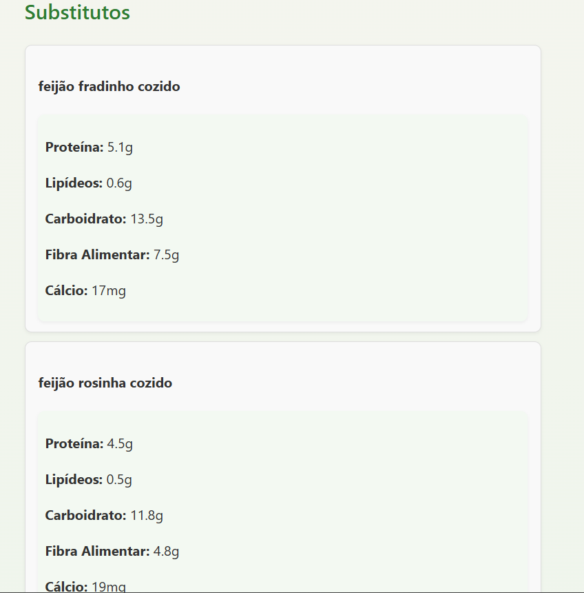

# Grafos1_Rocha_Grafos

**Número da Lista**: 1  
**Conteúdo da Disciplina**: Grafos 1  

---

## Alunos

| Matrícula   | Aluno                   |
|-------------|-------------------------|
| 22/2022000  | Milena Fernandes Rocha |
| 20/2045348  | Ingrid Alves Rocha     |

---

##  Sobre o Projeto

Este projeto explora o uso da estrutura de dados **grafo** em conjunto com o algoritmo **Breadth-First Search (BFS)** para identificar relações de similaridade entre alimentos com base em seus valores nutricionais.

A proposta permite:
- Explorar conexões nutricionais entre diferentes alimentos sempre comparado cada porção de 100g.
- Identificar **substitutos alimentares inteligentes**.
- Navegar por uma rede de alimentos baseada em **semelhança nutricional**.

---

## Tecnologias Utilizadas

- **Python**
- **FastAPI** (para desenvolvimento do backend)
- **Docker** (para empacotamento e execução)
- **Pandas** (para manipulação dos dados)
- **Jupyter Notebook** (para limpeza inicial dos dados)

---

## Pré-processamento e Dataset

Foi utilizado um **notebook de limpeza chamado `limpeza.ipynb`** para organizar e preparar os dados nutricionais.

### Fonte do Dataset

Os dados foram obtidos do Kaggle:

- [Composição Nutricional de Alimentos (TACO)](https://www.kaggle.com/datasets/ispangler/composio-nutricional-de-alimentos-taco)

Após o tratamento dos dados, geramos o arquivo `taco-db-nutrientes.parquet`, que é o dataset principal utilizado no backend da aplicação.

---

## Estrutura do Grafo

### 1. Construção

- O grafo é representado como um **dicionário de adjacência**:
- Cada vértice representa um alimento, e cada aresta é uma conexão ponderada com outro alimento, baseada na **distância nutricional**.

### 2. Cálculo da Similaridade

A distância entre dois alimentos é calculada usando a **distância Euclidiana** considerando os seguintes nutrientes:

```python
nutrientes = ['Proteína (g)', 'Lipídeos (g)', 'Carboidrato (g)', 'Fibra Alimentar (g)', 'Cálcio (mg)']
```

---

## Algoritmo de Substituição com BFS

- A função `get_substitutes(alimento, k=5)` implementa uma busca em largura (BFS) sobre o grafo de alimentos. 
- Retorna até `k` alimentos substitutos com nutrientes similares.

---

## Como Executar

### 1. Clonar o Repositório

```bash
git clone https://github.com/projeto-de-algoritmos-2025/Grafos1_Rocha_Grafos.git
cd Grafos1_Rocha_Grafos
```

---

### 2. Obter o Dataset

Certifique-se de que o arquivo `taco-db-nutrientes.parquet` esteja na pasta `data/`. Caso contrário:

1. Acesse o [Kaggle](https://www.kaggle.com/datasets/ispangler/composio-nutricional-de-alimentos-taco)
2. Baixe o CSV original.
3. Execute o notebook `limpeza.ipynb` para converter o CSV no formato `.parquet`.

---

### 3. Executar com Docker (Opcional)

1. Instale o [Docker](https://docs.docker.com/get-docker/) e o abra
2. No terminal, execute:

```bash
docker compose up --build
```

3. Acesse a aplicação via navegador em:  
   `http://localhost:8000`

---

## Screenshots

<p align="center">
  <b>Informações nutricionais da Lentilha Cozida</b><br>
  
</p>

<p align="center">
  <b>Substitutos mais similares</b><br>
  
  
  
</p>


---

